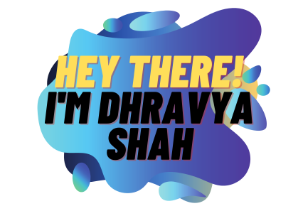

<h1>Welcome to my README  </h1>

## ✨ Some stuff about me
- 👨🏽‍💻 I’m currently working on [A lot of things, a lot.](https://dhravya.me)
- I'm most experienced in Python, Javascript, and tailwindcss websites
- 🤔 Looking for projects to collaborate on / collaborators for my projects
- 💻 Currently learning React and C.
- 🌱  Love for science and innovation.
- 🤖 I'm a Discord verified bot developer and have made [Spacebot](https://top.gg/bot/881862674051391499) and [Millenia](https://millenia.tech)
- 💬 [Ask me](https://discord.gg/rqhgqTqFbp) about anything, I am happy to help
- 📫 How to reach me: [Join discord](https://discord.gg/rqhgqTqFbp) or [dhravyashah@gmail.com](mailto:dhravyashah@gmail.com)

## Languages and Tools:
**Programming Languages**

||
|--|--|--|

**Databases**

|||| 
|--|--|--|--|--|

**Tools**

||||
|--|--|--|--|--|
 

<a href="https://blog.dhravya.dev">
<h2>Check out my blog!!</h2>
</a>

### 📱 Latest Tweets

<!-- TWITTER:START -->
- [@DhravyaShah: Quastor Daily blogs are always the best. Here&#39;s one on How Go Mitigates Supply Chain Attacks. It also talks about bloom filters, and some tech snippets](https://rss.app/articles/cb4e791f6f6d729c074351566bd3a7c508111d6e3b37a0e0d4fb86298d876f88f10ba4482c9bc169f6a36b7add17069a62d56ae1c5177f10883e)
- [@Amit_T18: Like a phone battery, we humans also burn out!Do remember to recharge by🔹 Exercising.🔹 Meditation.🔹 Helping others.🔹 Taking deep naps. 🔹 Spreading positivity.🔹 Doing things you like.🔹 Listening to soothing music.](https://rss.app/articles/cb4e791f6f6d729c074351566bd3a7c508111d6e3e32bbf5fdd6d642ca9573c6f60ab61368dddf69f6ab6d74da1c099064d560e3c1137a)
- [@DhravyaShah: APIs: Explained to a 5 year old 👶🏻 &lpar;not what you think!&rpar; by @DhravyaShah #DEVCommunity  Click the share to twitter button if you really liked it!](https://rss.app/articles/cb4e791f6f6d729c074351566bd3a7c508111d6e3b37a0e0d4fb86298d876f88f10ba4482c9bc169f6a36b78d6100f9066d56de6cb1473128f3b)
- [@DhravyaShah: I just hit 400 followers on dev community! 🥳🥳🥳 Thank you soooo much for supporting and motivating me to keep writing tutorials and blogs!](https://rss.app/articles/cb4e791f6f6d729c074351566bd3a7c508111d6e3b37a0e0d4fb86298d876f88f10ba4482c9bc169f6a36b78d817079268d768e9c31a7d178c39)
- [@Param_eth: RIP to those who directly jump into Web3 without doing the Web2 development. 😅](https://rss.app/articles/cb4e791f6f6d729c074351566bd3a7c508111d6e2f3ea0e0cfdd820e8dc974d3e30bb04f76d9db69f2a7697dd7140c9566d768e1c2137816)
<!-- TWITTER:END -->

  

